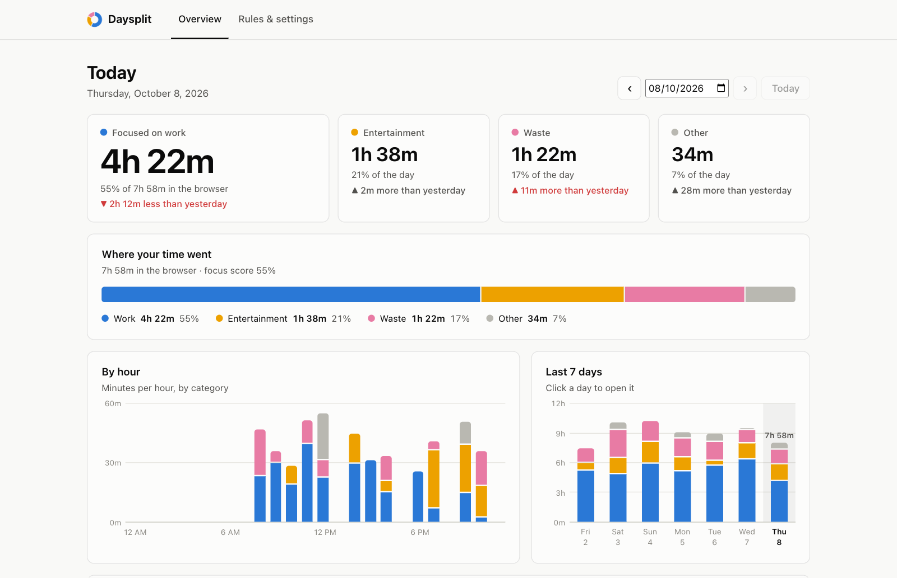
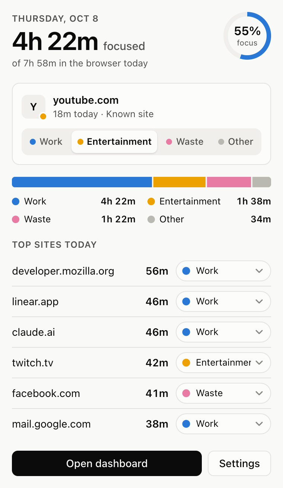

# Daysplit: website time tracker

[](https://github.com/ShaifArfan/daysplit/actions/workflows/ci.yml)

A browser extension that tracks how long you spend on each website and sorts that time into **Work**, **Entertainment**, **Waste** and **Other**. At the end of the day you can see how much of your browser time was focused work.

It runs in Chromium browsers (Chrome, Brave, Edge, Arc, Vivaldi, Opera) and Firefox browsers (Firefox, Zen, LibreWolf, Floorp). All data stays in your browser. Nothing is sent anywhere ([privacy policy](PRIVACY.md)).

<picture>
  <source media="(prefers-color-scheme: dark)" srcset="docs/dashboard-dark.png">
  
</picture>

## What you get

- **Popup** (toolbar icon): today's focused time, focus score, the current site with a one-click category switch, today's split, and your top sites.
- **Dashboard**: daily stats compared with the previous day, a by-hour chart, the last 7 days, and a full sites table where you can change any site's category.
- **Toolbar badge**: today's work time, colored by the current site's category, so you can tell at a glance when you've drifted onto a "waste" site.
- **End-of-day notification** (21:00 by default) with the day's totals.
- **Rules & settings**: your own domain rules, idle timeout, badge mode, history retention, and JSON export/import.

<p align="center">
  <picture>
    <source media="(prefers-color-scheme: dark)" srcset="docs/popup-dark.png">
    
  </picture>
</p>

Screenshots use a week of demo data.

## How time is counted

A site only counts while all of these are true:

1. A browser window has focus. Switching to another app pauses tracking.
2. The site is the active tab in that window.
3. You aren't idle (2 minutes by default). Exception: a tab playing sound keeps counting, so a video or call you're watching without touching the keyboard still counts. You can turn this off.

A locked screen never counts. Private/incognito windows are never tracked. Browser pages (`chrome://`, `about:`) and extension pages don't count either.

Time is stored per site per hour. Categories are applied when you look at the data, so recategorizing a site also fixes every past day.

## How categories are picked

Checked in this order, first match wins:

1. **Your rules.** Pick a category in the popup or dashboard, or add a rule in Settings. A rule for `google.com` also covers `mail.google.com`, unless you've set a more specific rule.
2. **Local dev servers**, such as `localhost:3000`, `127.0.0.1`, `*.test` and `*.local`, count as Work. Each port is tracked separately.
3. **Built-in list** of about 200 well-known sites in [src/lib/sites.js](src/lib/sites.js): GitHub, Docs and Claude are Work; YouTube and Netflix are Entertainment; Instagram, X and Reddit are Waste.
4. **Words in the address.** `docs.python.org` contains "docs", so it's probably Work. `something.tv` is probably Entertainment.
5. Anything still unknown goes to **Other** and gets a "Not sorted yet" filter in the dashboard, so you can sort the leftovers in one pass.

## Install

Build first. You need Node 22 or newer, and there are no dependencies:

```bash
npm run build
```

That creates `dist/chromium` and `dist/firefox`.

### Chrome, Brave, Edge, Arc

1. Open `chrome://extensions` (Brave: `brave://extensions`, Edge: `edge://extensions`).
2. Turn on **Developer mode**.
3. Click **Load unpacked** and pick the `dist/chromium` folder.
4. Pin the Daysplit icon to the toolbar.

This install is permanent. After changing the code, rebuild and click the reload icon on the extension card.

### Firefox and Zen

**Quick try (temporary).** Open `about:debugging#/runtime/this-firefox`, click **Load Temporary Add-on…**, and pick `dist/firefox/manifest.json`. Firefox removes temporary add-ons when it restarts. Your data is kept, because the add-on has a fixed ID.

**Permanent install.** Regular Firefox only installs signed add-ons. You have two options:

- **Sign it for yourself (free, recommended).** Mozilla signs "unlisted" add-ons automatically, and they never appear on the store. Create API keys at <https://addons.mozilla.org/developers/addon/api/key/>, then run:
  ```bash
  npx web-ext sign --source-dir dist/firefox --channel unlisted --api-key "$AMO_JWT_ISSUER" --api-secret "$AMO_JWT_SECRET"
  ```
  This gives you a signed `.xpi`. Drag it into any Firefox-based browser to install it.
- **Turn off signature checks.** This works only in builds that allow it, such as Firefox Developer Edition, Nightly, ESR and LibreWolf. Set `xpinstall.signatures.required` to `false` in `about:config`, then install `dist/daysplit-firefox-<version>.zip`. Some forks ignore this setting.

## Development

```bash
npm test             # tracking logic tests (runs the real background script against a fake browser API)
npm run build        # dist/chromium + dist/firefox
npm run package      # also writes store-ready zips in dist/
npm run lint:firefox # Mozilla's add-on linter on the Firefox build
npm run icons        # regenerate the PNG icons
npm run screenshots  # regenerate README and store images (needs Google Chrome; run npm run build first)
```

```
src/
  background.js          tracking engine (service worker on Chromium, event page on Firefox)
  lib/sites.js           built-in site list and address keywords (edit freely)
  lib/core.js            categorizing, storage, time math, summaries
  popup/                 toolbar popup
  dashboard/             full dashboard + settings (also the extension's options page)
  ui/                    shared styles and DOM helpers
scripts/build.mjs        writes a per-browser manifest.json into dist/
scripts/screenshots.mjs  loads the built extension in headless Chrome with demo data and captures images
store/                   store listing text, Firefox submission metadata, store images
test/                    node:test suites
```

Permissions used: `tabs` (to read the active tab's address), `storage`, `idle`, `alarms` (one-minute heartbeat and the daily summary) and `notifications`. Chromium also gets `unlimitedStorage`. No host permissions and no content scripts: Daysplit never reads page contents.

## Limits

- Each browser keeps its own data. Time in Brave and time in Zen are tracked separately. To move history between them, use Export and Import in Settings (Import replaces matching days rather than adding to them).
- Daysplit only sees the browser. Time in other apps isn't tracked.
- After you leave the computer, up to one idle timeout (2 minutes by default) is still counted before tracking stops.

## Contributing

Issues and pull requests are welcome.

- **A site is in the wrong category, or missing?** Add it to the right list in [src/lib/sites.js](src/lib/sites.js). Use the bare domain, like `example.com`; it covers subdomains too. Only list sites most people would put in the same category. Mixed-use sites like LinkedIn or Medium are better left to each person's own rules.
- **Changing code?** Run `npm test`, then `npm run build` and `npm run lint:firefox`. GitHub runs the same checks on every pull request. For changes to tracking or the UI, try them in at least one Chromium browser and one Firefox browser.
- **Keep it private and simple.** No network requests, no analytics, no content scripts, no runtime dependencies.

## License

[MIT](LICENSE)
